# 🗄️ IronRep - Backend ER Schema

## Database: PostgreSQL 16

---

## 📊 Entity Relationship Diagram (Mermaid)

```mermaid
erDiagram
    USERS ||--o{ PAIN_ASSESSMENTS : "has"
    USERS ||--o{ WORKOUT_SESSIONS : "has"
    USERS ||--o{ PROGRESS_KPI : "has"
    USERS ||--o{ BIOMETRIC_ENTRIES : "has"
    USERS ||--o{ CHAT_HISTORY : "has"
    USERS ||--o{ NUTRITION_PLANS : "has"
    USERS ||--o{ DAILY_NUTRITION_LOGS : "has"
    USERS ||--o{ WORKOUT_PLANS : "has"
    USERS ||--o{ USER_FAVORITE_FOODS : "has"

    FOOD_CACHE ||--o{ USER_FAVORITE_FOODS : "referenced_by"

    USERS {
        string id PK "UUID"
        string email UK "unique, indexed"
        string password_hash
        string name
        int age
        float weight_kg
        float height_cm
        string sex "M/F"
        datetime injury_date
        string diagnosis "default: Sciatica"
        json pain_locations "array"
        text injury_description
        float baseline_deadlift_1rm
        float baseline_squat_1rm
        float baseline_front_squat_1rm
        float baseline_bench_press_1rm
        float baseline_shoulder_press_1rm
        float baseline_snatch_1rm
        float baseline_clean_jerk_1rm
        int baseline_pullups_max
        string current_phase "Fase 1-4"
        int weeks_in_current_phase
        datetime program_start_date
        datetime target_return_date
        string primary_goal
        text goals_description
        json equipment_available "array"
        string preferred_training_time
        int session_duration_minutes
        bool is_active
        bool is_onboarded
        datetime created_at
        datetime updated_at
        datetime last_login_at
    }

    PAIN_ASSESSMENTS {
        string id PK
        string user_id FK
        datetime date "indexed"
        int pain_level "0-10"
        json pain_locations "array"
        json triggers "array"
        bool medication_taken
        text notes
        datetime created_at
    }

    WORKOUT_SESSIONS {
        string id PK
        string session_id UK "indexed"
        string user_id FK
        datetime date "indexed"
        string phase
        json warm_up "exercises array"
        json technical_work "exercises array"
        json conditioning "exercises array"
        json cool_down "exercises array"
        string estimated_pain_impact
        json contraindications "array"
        bool completed
        int actual_pain_impact "0-10"
        text feedback
        datetime created_at
        datetime updated_at
    }

    PROGRESS_KPI {
        string id PK
        string user_id FK
        int week "indexed"
        datetime start_date
        datetime end_date
        float avg_pain_level
        int max_pain_level
        int min_pain_level
        float pain_free_time_hours
        int rom_hip_flexion
        int rom_lumbar_flexion
        float max_deadlift_kg
        float max_squat_kg
        int planned_sessions
        int completed_sessions
        float compliance_rate "percentage"
        datetime created_at
    }

    BIOMETRIC_ENTRIES {
        string id PK
        string user_id FK
        datetime date "indexed"
        string type "indexed: strength/rom/body/cardio"
        string exercise_id "indexed"
        string exercise_name
        float weight_kg
        int reps
        float estimated_1rm
        string rom_test
        float rom_degrees
        string rom_side "L/R"
        float weight
        float body_fat_percent
        float muscle_mass_kg
        int resting_hr
        int hrv
        float vo2max_estimate
        text notes
        datetime created_at
    }

    CHAT_HISTORY {
        int id PK "auto-increment"
        string user_id FK
        string session_id "indexed"
        string role "user/assistant"
        text content
        json message_metadata
        datetime timestamp
        datetime created_at
    }

    EXERCISES {
        string id PK
        string name
        string category "indexed"
        string movement_pattern
        json phases "array"
        json equipment "array"
        json contraindications "array"
        json progressions "array"
        json regressions "array"
        json coaching_cues "array"
        string video_url
        string thumbnail_url
        int sets_range_min
        int sets_range_max
        int reps_range_min
        int reps_range_max
        int rest_seconds
        string difficulty "indexed: beginner/intermediate/advanced"
        json injury_risk_profile "multi-injury data"
        json modifications "injury-specific"
        text description
        bool is_active "indexed"
        datetime created_at
        datetime updated_at
    }

    WORKOUT_PLANS {
        string id PK "UUID"
        string user_id FK
        datetime date "indexed"
        string status "generated/completed/skipped"
        string title
        text description
        json exercises "array"
        int duration_minutes
        json constraints "MedicalReport"
        string clearance_level "RED/YELLOW/GREEN"
        int max_intensity_percent
        datetime completed_at
        text feedback
        int pain_after "0-10"
        datetime created_at
        datetime updated_at
    }

    NUTRITION_PLANS {
        string id PK
        string user_id FK
        string goal
        string diet_type
        int target_calories
        int target_protein
        int target_carbs
        int target_fat
        json weekly_schedule "full meal structure"
        datetime created_at
    }

    DAILY_NUTRITION_LOGS {
        string id PK
        string user_id FK
        date date "indexed"
        json meals "array of meals"
        int water_ml
        json supplements "array"
        string notes
        int total_calories "cached"
        int total_protein "cached"
        int total_carbs "cached"
        int total_fat "cached"
    }

    FOOD_CACHE {
        string id PK
        string fatsecret_id UK "indexed"
        string name "indexed"
        string brand
        string type
        json data "full FatSecret response"
        datetime created_at
        datetime updated_at
    }

    USER_FAVORITE_FOODS {
        string id PK
        string user_id FK
        string food_id FK
        datetime created_at
    }

    USER_PROFILE {
        string id PK
        string name
        int age
        string activity_level
        datetime injury_date
        text injury_description
        string diagnosis
        float baseline_deadlift_kg
        float baseline_squat_kg
        int current_week
        string current_phase
        datetime program_start_date
        datetime target_return_date
        text goals
        datetime created_at
        datetime updated_at
    }
```



---

## 📋 Tables Summary

| Table | Records | Description |
|-------|---------|-------------|
| `users` | Core | Utenti con profilo completo, baseline strength, preferenze |
| `pain_assessments` | Daily | Check-in giornalieri dolore (0-10, localizzazioni, trigger) |
| `workout_sessions` | Per-workout | Sessioni allenamento con esercizi per sezione |
| `progress_kpi` | Weekly | KPI settimanali (pain avg, compliance, ROM, strength) |
| `biometric_entries` | Periodic | Misurazioni biometriche (forza, ROM, composizione, cardio) |
| `chat_history` | Per-message | Storico conversazioni con agenti AI |
| `exercises` | Reference | Libreria esercizi con risk profile multi-infortunio |
| `workout_plans` | Per-day | Piani allenamento generati con constraints medici |
| `nutrition_plans` | Per-user | Piani nutrizionali con macro targets |
| `daily_nutrition_logs` | Daily | Log giornaliero pasti e macro |
| `food_cache` | Cache | Cache alimenti FatSecret API |
| `user_favorite_foods` | Per-user | Alimenti preferiti utente |

---

## 🔗 Key Relationships

### User-Centric (1:N)
- `users` → `pain_assessments` (daily check-ins)
- `users` → `workout_sessions` (training history)
- `users` → `progress_kpi` (weekly metrics)
- `users` → `biometric_entries` (measurements)
- `users` → `chat_history` (AI conversations)
- `users` → `nutrition_plans` (meal plans)
- `users` → `daily_nutrition_logs` (food logs)
- `users` → `workout_plans` (generated plans)
- `users` → `user_favorite_foods` (favorites)

### Reference Data
- `food_cache` → `user_favorite_foods` (cached foods)
- `exercises` (standalone reference table)

---

## 🏷️ Indexes

| Table | Indexed Columns |
|-------|-----------------|
| users | email (unique), id |
| pain_assessments | user_id, date |
| workout_sessions | user_id, date, session_id |
| progress_kpi | user_id, week |
| biometric_entries | user_id, date, type, exercise_id |
| chat_history | user_id, session_id |
| exercises | category, difficulty, is_active |
| workout_plans | user_id, date |
| food_cache | fatsecret_id, name |

---

## 🔄 Cascade Deletes

Tutte le tabelle figlie hanno `ON DELETE CASCADE` su `user_id`:
- Eliminando un utente, tutti i suoi dati vengono rimossi automaticamente

---

## 📊 Data Flow

```
┌─────────────────────────────────────────────────────────────────┐
│                         USER JOURNEY                            │
├─────────────────────────────────────────────────────────────────┤
│                                                                 │
│  1. ONBOARDING                                                  │
│     └─> users (profile, baseline, goals)                        │
│                                                                 │
│  2. DAILY CHECK-IN                                              │
│     └─> pain_assessments (pain level, locations, triggers)      │
│                                                                 │
│  3. WORKOUT GENERATION                                          │
│     └─> workout_plans (AI-generated with constraints)           │
│     └─> exercises (reference library)                           │
│                                                                 │
│  4. WORKOUT EXECUTION                                           │
│     └─> workout_sessions (completed workouts)                   │
│     └─> biometric_entries (strength tests)                      │
│                                                                 │
│  5. NUTRITION TRACKING                                          │
│     └─> nutrition_plans (macro targets)                         │
│     └─> daily_nutrition_logs (food logs)                        │
│     └─> food_cache (FatSecret API cache)                        │
│                                                                 │
│  6. PROGRESS TRACKING                                           │
│     └─> progress_kpi (weekly aggregates)                        │
│                                                                 │
│  7. AI CONVERSATIONS                                            │
│     └─> chat_history (Medical, Coach, Nutrition agents)         │
│                                                                 │
└─────────────────────────────────────────────────────────────────┘
```
