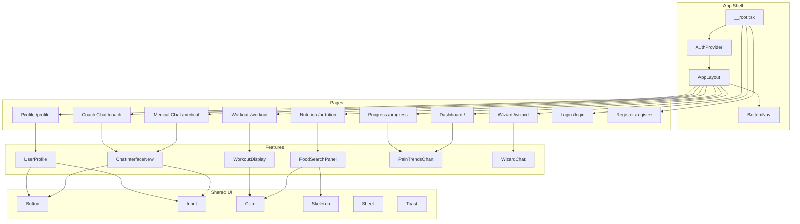
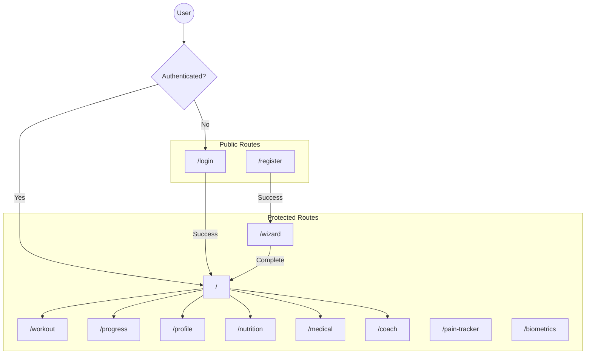
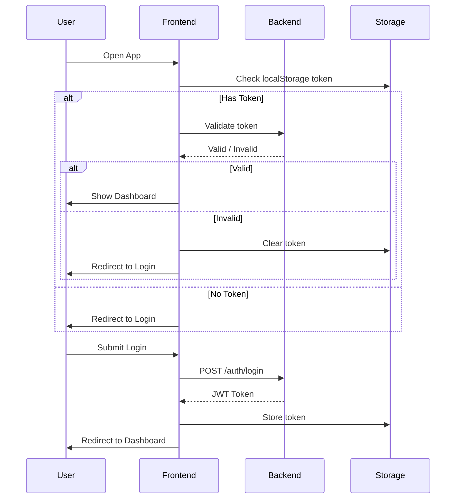

# 🎨 IronRep - Frontend Architecture

## Stack: React 19 + TypeScript + Vite + TanStack Router

---

## 📁 Project Structure

```
apps/frontend/src/
├── components/           # Shared UI components
│   └── layout/
│       ├── AppLayout.tsx      # Main layout wrapper
│       ├── BottomNav.tsx      # Mobile navigation
│       ├── Sidebar.tsx        # Desktop sidebar
│       └── MobileDrawer.tsx   # Mobile menu drawer
│
├── features/             # Feature modules (domain-driven)
│   ├── auth/
│   │   ├── AuthContext.tsx    # Auth state provider
│   │   ├── LoginForm.tsx
│   │   └── RegisterForm.tsx
│   │
│   ├── chat/
│   │   ├── ChatInterfaceNew.tsx   # Main chat component
│   │   ├── ChatMessages.tsx       # Message list
│   │   ├── MessageInput.tsx       # Input with voice
│   │   └── MessageBubble.tsx      # Single message
│   │
│   ├── home/
│   │   ├── CurrentPhaseCard.tsx   # Phase progress
│   │   ├── PainTrendMiniChart.tsx # Pain sparkline
│   │   └── ComplianceWidget.tsx   # Workout compliance
│   │
│   ├── nutrition/
│   │   ├── components/
│   │   │   └── FoodSearch/
│   │   │       ├── FoodSearchPanel.tsx  # Search + filters
│   │   │       └── FoodItemCard.tsx     # Food result card
│   │   ├── hooks/
│   │   │   └── useFoodSearch.ts   # TanStack Query hooks
│   │   └── api/
│   │       └── fatSecretApi.ts    # API client
│   │
│   ├── profile/
│   │   └── UserProfile.tsx        # Profile form
│   │
│   ├── progress/
│   │   ├── PainTrendsChart.tsx    # Recharts pain graph
│   │   ├── ProgressCalendar.tsx   # Activity calendar
│   │   └── WorkoutHistory.tsx     # Past workouts
│   │
│   ├── wizard/
│   │   ├── WizardChat.tsx         # Onboarding wizard
│   │   └── index.ts
│   │
│   └── workout/
│       ├── WorkoutDisplay.tsx     # Workout viewer
│       ├── MobileWorkoutView.tsx  # Mobile swipeable
│       └── SwipeableCard.tsx      # Swipe component
│
├── lib/
│   └── api.ts            # Axios instance + API functions
│
├── routes/               # TanStack Router pages
│   ├── __root.tsx        # Root layout + auth guard
│   ├── index.lazy.tsx    # Dashboard (/)
│   ├── login.lazy.tsx    # Login (/login)
│   ├── register.lazy.tsx # Register (/register)
│   ├── workout.lazy.tsx  # Workout (/workout)
│   ├── progress.lazy.tsx # Progress (/progress)
│   ├── profile.lazy.tsx  # Profile (/profile)
│   ├── nutrition.lazy.tsx # Nutrition (/nutrition)
│   ├── medical.lazy.tsx  # Medical chat (/medical)
│   ├── coach.lazy.tsx    # Coach chat (/coach)
│   └── wizard.lazy.tsx   # Onboarding (/wizard)
│
├── shared/
│   ├── components/
│   │   └── ui/           # shadcn/ui components
│   │       ├── button.tsx
│   │       ├── input.tsx
│   │       ├── card.tsx
│   │       ├── badge.tsx
│   │       ├── skeleton.tsx   # Loading placeholder
│   │       ├── sheet.tsx      # Bottom drawer
│   │       └── toast.tsx      # Notifications
│   └── hooks/
│       └── useDebounce.ts
│
├── index.css             # Tailwind + custom animations
├── main.tsx              # App entry point
└── routeTree.gen.ts      # Auto-generated routes
```

---

## 🔄 Component Diagram



---

## 🛣️ Routing Architecture



---

## 📊 State Management

### Auth State (Context)
```typescript
interface AuthContextType {
  user: UserProfile | null;
  token: string | null;
  isAuthenticated: boolean;
  isLoading: boolean;
  login: (token: string) => void;
  logout: () => void;
}
```

### Server State (TanStack Query)
```typescript
// Food Search
useQuery(['foods', 'search', query])
useQuery(['foods', 'categories'])
useQuery(['foods', 'details', foodId])

// Progress
useQuery(['progress', 'dashboard'])
useQuery(['progress', 'pain-trends', days])
useQuery(['progress', 'workout-history', limit])
useQuery(['progress', 'kpis', days])

// User
useQuery(['user', 'profile', userId])
useMutation(['user', 'update'])

// Chat
useQuery(['chat', 'history', sessionId])
useMutation(['chat', 'send'])
```

---

## 🎨 UI Component Library

### Base Components (shadcn/ui)
| Component | Usage |
|-----------|-------|
| `Button` | Actions, CTAs |
| `Input` | Text fields |
| `Card` | Content containers |
| `Badge` | Tags, status |
| `Skeleton` | Loading states |
| `Sheet` | Bottom drawers (mobile) |
| `Toast` | Notifications |

### Custom Components
| Component | Purpose |
|-----------|---------|
| `SwipeableCard` | Swipe-to-complete exercises |
| `FoodItemCard` | Food search results |
| `MessageBubble` | Chat messages |
| `PainTrendMiniChart` | Sparkline chart |
| `ComplianceWidget` | Progress ring |

---

## 📱 Mobile-First Design

### CSS Utilities (`index.css`)
```css
/* Safe Area */
.safe-area-top { padding-top: env(safe-area-inset-top); }
.safe-area-bottom { padding-bottom: env(safe-area-inset-bottom); }

/* Touch Optimizations */
.touch-manipulation { touch-action: manipulation; }

/* Animations */
@keyframes fade-in { from { opacity: 0; } to { opacity: 1; } }
@keyframes slide-up { from { transform: translateY(10px); opacity: 0; } }
@keyframes bounce { 0%, 100% { transform: translateY(-5%); } }
@keyframes shimmer { 0% { background-position: -200% 0; } }

/* Glass Effect */
.glass {
  background: rgba(255, 255, 255, 0.8);
  backdrop-filter: blur(10px);
}
```

### Responsive Breakpoints
```typescript
// Tailwind defaults
sm: 640px   // Mobile landscape
md: 768px   // Tablet
lg: 1024px  // Desktop
xl: 1280px  // Large desktop
```

---

## 🔌 API Integration

### Axios Instance (`lib/api.ts`)
```typescript
const api = axios.create({
  baseURL: import.meta.env.VITE_API_URL || '/api',
  headers: { 'Content-Type': 'application/json' }
});

// Auth interceptor
api.interceptors.request.use((config) => {
  const token = localStorage.getItem('token');
  if (token) config.headers.Authorization = `Bearer ${token}`;
  return config;
});
```

### API Modules
| Module | Endpoints |
|--------|-----------|
| `authApi` | login, register, logout |
| `usersApi` | getProfile, updateProfile |
| `checkinApi` | submit, getHistory |
| `workoutApi` | generate, complete, getHistory |
| `progressApi` | getDashboard, getPainTrends, getKPIs |
| `chatApi` | sendMessage, getHistory |
| `fatSecretApi` | searchFoods, getDetails, getCategories |

---

## 🧭 Navigation Structure

### Bottom Navigation (Mobile)
```
┌─────────────────────────────────────────┐
│  🏠      💪      📊      🍽️      👤    │
│ Home   Workout Progress Nutrition Profile│
└─────────────────────────────────────────┘
```

### Quick Actions (Dashboard)
```
┌─────────────────────────────────────────┐
│  📝 Check-in    💬 Medical    🏋️ Coach │
└─────────────────────────────────────────┘
```

---

## 🔐 Authentication Flow



---

## 📦 Dependencies

### Core
- `react` ^19.0.0
- `typescript` ^5.6.0
- `vite` ^6.0.0

### Routing
- `@tanstack/react-router` ^1.0.0

### State
- `@tanstack/react-query` ^5.0.0

### UI
- `tailwindcss` ^3.4.0
- `framer-motion` ^11.0.0
- `lucide-react` (icons)
- `recharts` (charts)

### Forms
- `react-hook-form` ^7.0.0
- `zod` (validation)

### Utils
- `axios` (HTTP)
- `date-fns` (dates)
- `sonner` (toasts)
