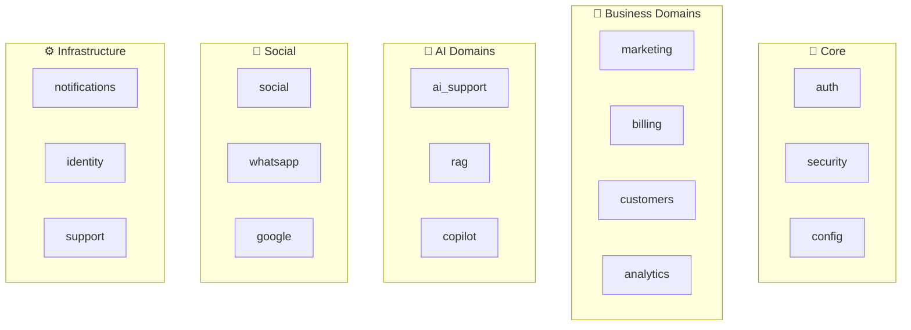
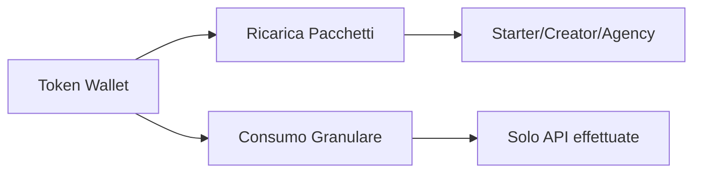
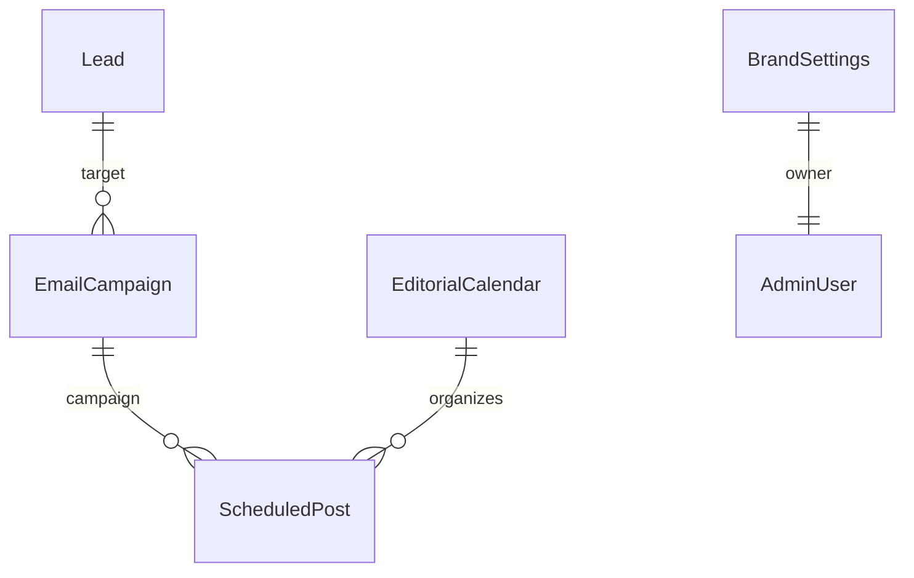

# 🚀 MARKETTINA - Codebase Analysis & Architecture Walkthrough

## Executive Summary

**MARKETTINA** è una piattaforma SaaS enterprise per **AI Marketing Automation** "Made in Italy 🇮🇹". Non è un semplice wrapper di GPT, ma un sistema completo di **agenti AI autonomi** che collaborano per gestire l'intero ciclo di vita del marketing aziendale.

---

## 📁 Struttura del Repository

```
markettina/
├── apps/
│   ├── backend/         # 🐍 FastAPI + PostgreSQL (Python 3.12)
│   └── frontend/        # ⚛️ React 18 + Vite + TailwindCSS
├── config/              # Configurazioni ambiente
├── docs/                # Documentazione
├── scripts/             # Script di deployment/utility
└── Makefile             # Comandi di build/deploy
```

---

## 🏗️ Architettura Backend

### Stack Tecnologico

| Component | Technology | Version |
|-----------|------------|---------|
| Framework | FastAPI | 2.x |
| Database | PostgreSQL | 16 |
| ORM | SQLAlchemy | 2.0 |
| Migrations | Alembic | - |
| Cache | Redis | 7 |
| Monitoring | Sentry | - |
| Auth | JWT + OAuth2 | - |

### Domain-Driven Design (DDD)

Il backend segue un'architettura **DDD** con 22 domini isolati:



#### Tutti i Domini (22):

| Dominio | Descrizione | File Chiave |
|---------|-------------|-------------|
| `auth` | Autenticazione JWT, OAuth, MFA, password reset | 35 files |
| `billing` | Fatture, pricing, promo codes, subscriptions, **Token Economy** | 10 files |
| `marketing` | Lead generation, email campaigns, calendario editoriale, Brand DNA | 25+ files |
| `customers` | CRM, gestione clienti | 6 files |
| `analytics` | Metriche, dashboard, eventi | 7 files |
| `social` | Integrazione social media multi-piattaforma | 5 files |
| `whatsapp` | WhatsApp Business API | 5 files |
| `google` | Google Analytics, GMB, OAuth | 11 files |
| `rag` | Retrieval-Augmented Generation | 5 files |
| `ai_support` | Chatbot supporto AI | 3 files |
| `identity` | Account, SocialAccount, Permissions | 5 files |
| `support` | Ticket supporto | 8 files |
| `notifications` | Sistema notifiche | 6 files |
| `heygen` | Video generation con avatar AI | 2 files |
| `finance` | Gestione finanziaria | 7 files |
| `seo` | Analisi SEO | 2 files |
| `workflow` | Workflow automation | 2 files |
| `copilot` | AI assistant | 2 files |
| `media` | Gestione media | 2 files |
| [portfolio](file:///home/ciroautuori/Scrivania/markettina/apps/backend/app/domain/auth/models.py#141-145) | Portfolio progetti | TBD |
| `shared` | Utilities condivise | 2 files |

---

## 👤 Sistema Utenti e Ruoli

### Modello User ([domain/auth/models.py](file:///home/ciroautuori/Scrivania/markettina/apps/backend/app/domain/auth/models.py))

```python
class UserRole(str, Enum):
    ADMIN = "admin"        # Super admin - accesso completo
    TRIAL = "trial"        # Trial 30 giorni - accesso completo
    USER = "user"          # Ex-trial scaduti - portfolio privati
    CUSTOMER = "customer"  # Abbonamento base attivo
    PRO = "pro"            # Abbonamento premium attivo
    TESTER = "tester"      # Account test con features PRO
```

**Proprietà chiave del modello User:**
- [is_admin](file:///home/ciroautuori/Scrivania/markettina/apps/backend/app/domain/auth/models.py#96-100), [is_trial](file:///home/ciroautuori/Scrivania/markettina/apps/backend/app/domain/auth/models.py#101-110), [is_trial_expired](file:///home/ciroautuori/Scrivania/markettina/apps/backend/app/domain/auth/models.py#111-120), [is_customer](file:///home/ciroautuori/Scrivania/markettina/apps/backend/app/domain/auth/models.py#121-125), [is_pro](file:///home/ciroautuori/Scrivania/markettina/apps/backend/app/domain/auth/models.py#126-130)
- [has_premium_access](file:///home/ciroautuori/Scrivania/markettina/apps/backend/app/domain/auth/models.py#136-140) → PRO, TESTER, o Trial attivo
- [can_publish_portfolio](file:///home/ciroautuori/Scrivania/markettina/apps/backend/app/domain/auth/models.py#141-145) → TRIAL, CUSTOMER, PRO, TESTER

---

## 💰 Sistema Billing & Token Economy

### Modello Pay-per-Use

Nessun abbonamento mensile bloccato. Sistema basato su **Token Consumption**:



### Struttura Billing ([domain/billing/models.py](file:///home/ciroautuori/Scrivania/markettina/apps/backend/app/domain/billing/models.py))

| Modello | Descrizione |
|---------|-------------|
| `TokenWallet` | Wallet token per account |
| `TokenPackage` | Pacchetti acquistabili |
| `TokenTransaction` | Storico transazioni |
| [ServicePricing](file:///home/ciroautuori/Scrivania/markettina/apps/backend/app/domain/billing/models.py#52-81) | Costo token per servizio AI |
| [Invoice](file:///home/ciroautuori/Scrivania/markettina/apps/backend/app/domain/billing/models.py#83-134) / [InvoiceItem](file:///home/ciroautuori/Scrivania/markettina/apps/backend/app/domain/billing/models.py#136-159) | Fatturazione |
| [PromoCode](file:///home/ciroautuori/Scrivania/markettina/apps/backend/app/domain/billing/models.py#161-202) / [PromoRedemption](file:///home/ciroautuori/Scrivania/markettina/apps/backend/app/domain/billing/models.py#204-226) | Codici sconto |
| [SubscriptionPlan](file:///home/ciroautuori/Scrivania/markettina/apps/backend/app/domain/billing/models.py#278-315) / [Subscription](file:///home/ciroautuori/Scrivania/markettina/apps/backend/app/domain/billing/models.py#317-368) | Piani SaaS dinamici |
| [ReferralProgram](file:///home/ciroautuori/Scrivania/markettina/apps/backend/app/domain/billing/models.py#228-256) | Programma referral |

### Livelli Qualità AI

| Livello | Modelli | Uso |
|---------|---------|-----|
| **High** | GPT-4 / DALL-E 3 | Qualità massima |
| **Medium** | Claude 3.5 Sonnet / Stability | Bilanciato |
| **Low** | Llama 3 / GPT-3.5 | Velocità e risparmio |

---

## 📣 Marketing Domain

### Modelli Marketing ([domain/marketing/models.py](file:///home/ciroautuori/Scrivania/markettina/apps/backend/app/domain/marketing/models.py))



| Modello | Descrizione |
|---------|-------------|
| [Lead](file:///home/ciroautuori/Scrivania/markettina/apps/backend/app/domain/marketing/models.py#37-84) | Potenziale cliente (focus Salerno/Campania) |
| [EmailCampaign](file:///home/ciroautuori/Scrivania/markettina/apps/backend/app/domain/marketing/models.py#86-131) | Campagne email marketing |
| [ScheduledPost](file:///home/ciroautuori/Scrivania/markettina/apps/backend/app/domain/marketing/models.py#163-223) | Post programmati multi-piattaforma |
| [EditorialCalendar](file:///home/ciroautuori/Scrivania/markettina/apps/backend/app/domain/marketing/models.py#225-260) | Piano editoriale mensile/settimanale |
| [BrandSettings](file:///home/ciroautuori/Scrivania/markettina/apps/backend/app/domain/marketing/models.py#272-325) | Brand DNA + configurazione AI persona |

### Fonti Lead

- `WEBSITE`, [LINKEDIN](file:///home/ciroautuori/Scrivania/markettina/apps/backend/app/core/config.py#175-179), `GOOGLE_MAPS`, `EMAIL_CAMPAIGN`, `REFERRAL`
- `SALERNO_SEARCH`, `CAMPANIA_SEARCH`, `MANUAL`

### Piattaforme Social Supportate

- Facebook, Instagram, LinkedIn, Twitter, Threads, TikTok

---

## 🤖 Infrastruttura AI

### Architettura Agenti (`infrastructure/ai/`)

```
infrastructure/ai/
├── agents/
│   ├── base_agent.py          # Base class per tutti gli agenti
│   ├── llm_manager.py         # Gestione multi-provider LLM
│   ├── orchestrator.py        # Orchestrazione agenti
│   ├── cognitive_memory.py    # Memoria persistente agenti
│   ├── state.py               # State management
│   └── task.py                # Task definitions
├── collaboration/             # Agenti collaborativi
└── tools/                     # 12 tool categories
    ├── api_client.py
    ├── database_tools.py
    ├── docker_tools.py
    ├── file_tools.py
    ├── git_tools.py
    ├── knowledge_base.py
    ├── memory.py
    ├── quality_tools.py
    └── validators.py
```

### Squad AI Agents

| Agente | Funzione |
|--------|----------|
| 🕵️ **Lead Intelligence** | Arricchimento dati lead, discovery, scoring predittivo |
| 🎨 **Brand DNA Tech** | Apprendimento Tone of Voice e identità visiva |
| ✍️ **Content Creator** | Generazione articoli, post, copy in linea col brand |
| 📱 **Social Media Manager** | Scheduling, cross-posting, gestione commenti |
| 🎯 **Campaign Strategist** | Pianificazione campagne e ottimizzazione budget |
| 📈 **SEO Specialist** | Analisi keyword, ottimizzazione on-page |
| ⚔️ **Competitor Analyst** | Monitoraggio concorrenti e gap analysis |
| 🎨 **Image & Video Gen** | DALL-E 3, StabilityAI, HeyGen per avatar video |

---

## ⚛️ Frontend Architecture

### Stack Tecnologico

| Component | Technology |
|-----------|------------|
| Framework | React 18.3 |
| Build Tool | Vite 6 |
| Styling | TailwindCSS 3.4 |
| UI Components | Radix UI + shadcn/ui |
| State Management | Zustand 4 |
| Data Fetching | TanStack Query 5 |
| Forms | React Hook Form + Zod |
| Routing | React Router 7 |
| i18n | i18next |
| Animations | Framer Motion |
| Charts | Recharts |

### Struttura Features

```
frontend/src/
├── app/              # App shell
├── features/
│   ├── admin/        # 55+ pagine admin panel
│   │   ├── components/
│   │   ├── hooks/
│   │   ├── layouts/
│   │   ├── pages/
│   │   ├── services/
│   │   └── types/
│   ├── auth/         # Login/Register
│   ├── crm/          # CRM interface
│   ├── dashboard/    # Dashboard principale
│   ├── landing/      # Landing page pubblica
│   └── support/      # Supporto utente
├── services/         # API services
└── shared/           # Componenti condivisi
```

---

## 🗄️ Database Migrations

21 migrazioni Alembic che costruiscono lo schema completo:

| # | Migration | Descrizione |
|---|-----------|-------------|
| 001 | `initial_studiocentos_schema` | Schema base iniziale |
| 002 | `add_admin_tables` | Tabelle admin |
| 007 | `customers_domain` | CRM customers |
| 008 | `quotes_domain` | Preventivi |
| 010 | `scheduled_posts_editorial_calendar` | Calendario editoriale |
| 011 | `google_integration_settings` | Google integrations |
| 015 | `brand_settings` | Brand DNA |
| 016 | `whatsapp_messages` | WhatsApp |
| 017 | `identity_billing_context` | Identity + Billing base |
| 018 | `analytics_advanced` | Analytics avanzate |
| 019 | `workflow_persistence` | Workflow persistente |
| **020** | `v3_token_economy_billing` | **Token Economy v3** |

---

## 🔒 Security & Configuration

### Configurazione ([core/config.py](file:///home/ciroautuori/Scrivania/markettina/apps/backend/app/core/config.py))

100+ settings gestiti tramite `pydantic-settings`:

- **Database**: PostgreSQL con URL costruito dinamicamente
- **Auth**: JWT con validazione SECRET_KEY in produzione
- **OAuth**: Google, LinkedIn
- **Stripe**: Validazione chiavi LIVE vs TEST
- **Social**: Meta, Instagram, Twitter, WhatsApp APIs
- **AI**: OpenAI, Google AI, HuggingFace, Ollama, OpenRouter
- **CORS**: Environment-based (dev vs production)

### Security Features

- ✅ JWT Access + Refresh Tokens
- ✅ OAuth2 (Google, LinkedIn)
- ✅ MFA con Trusted Devices
- ✅ Rate Limiting
- ✅ Brute Force Protection
- ✅ API Key Rotation
- ✅ GDPR Compliance (preparato)
- ✅ Session Security

---

## 🐳 Docker Deployment

### Porte (evitano conflitti)

| Servizio | Porta |
|----------|-------|
| PostgreSQL | 5433 |
| Redis | 6380 |
| Backend | 8002 |
| AI Service | 8001 |
| Frontend | 3000 |
| Traefik | 8090/8443/8091 |

---

## 📚 Come Navigare il Codice

### Per capire l'autenticazione:
→ `backend/app/domain/auth/`

### Per capire il billing/token:
→ `backend/app/domain/billing/`

### Per capire il marketing:
→ `backend/app/domain/marketing/`

### Per capire gli agenti AI:
→ `backend/app/infrastructure/ai/agents/`

### Per capire la configurazione:
→ [backend/app/core/config.py](file:///home/ciroautuori/Scrivania/markettina/apps/backend/app/core/config.py)

### Per capire i modelli DB:
→ [backend/app/infrastructure/database/models_registry.py](file:///home/ciroautuori/Scrivania/markettina/apps/backend/app/infrastructure/database/models_registry.py)

---

## ✅ Summary

MARKETTINA è una piattaforma completa che combina:

1. **Architettura DDD** ben strutturata con 22+ domini
2. **Token Economy** innovativa (pay-per-use, non subscription)
3. **AI Agents Squad** specializzati per marketing automation
4. **Multi-platform Social** (FB, IG, LinkedIn, Twitter, Threads, WhatsApp)
5. **Frontend moderno** React 18 con Radix UI
6. **Enterprise-ready** security, monitoring, compliance

La codebase è matura, ben organizzata, e pronta per scalare.
