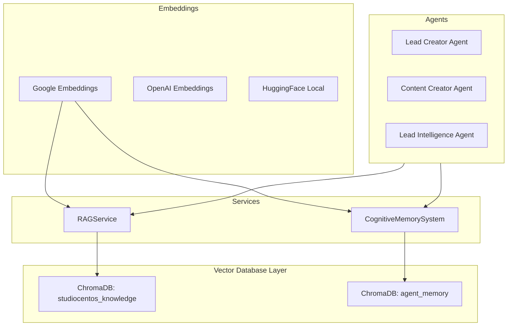
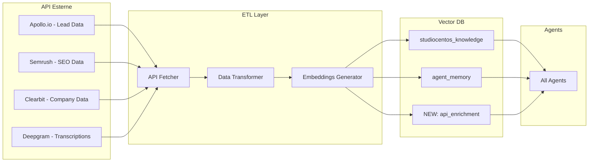

# 🧠 Piano Arricchimento Vector Database & RAG System

## Stato Attuale

### Architettura Vector DB Esistente



### ✅ Cosa Abbiamo

| Componente | File | Stato |
|------------|------|-------|
| **RAGService** | `app/domain/rag/service.py` | ✅ Attivo |
| **ChromaVectorStore** | `app/domain/rag/stores.py` | ✅ Attivo |
| **CognitiveMemorySystem** | `app/infrastructure/agents/cognitive_memory.py` | ✅ Attivo |
| **Google Embeddings** | `app/domain/rag/embeddings.py` | ✅ Attivo |
| **Populate Script** | `scripts/populate_rag.py` | ✅ Case Studies |

### 📊 Collezioni ChromaDB

1. **`studiocentos_knowledge`** → Documenti/Case Studies
   - Chunking: 500 chars con 50 overlap
   - Similarity threshold: 0.7
   - Persist: `/data/chromadb`

2. **`agent_memory`** → Memoria Agenti
   - Tipi: EPISODIC, SEMANTIC, PROCEDURAL, ERROR, SUCCESS
   - Pattern recognition automatico
   - Consolidation knowledge

---

## 🚀 Piano Arricchimento con Dati API

### Flusso Dati Proposto



---

## 📋 API Data → Vector DB Mapping

### 1. Lead Intelligence Data (Apollo.io, Hunter.io, Clearbit)

```python
# Nuovo: app/domain/rag/enrichers/lead_enricher.py
class LeadDataEnricher:
    """Arricchisce Vector DB con dati lead da API."""

    async def enrich_from_apollo(self, company_data: dict) -> None:
        """
        Embedding dati aziendali per retrieval veloce.

        Crea documenti con:
        - Profilo azienda (settore, dimensione, revenue)
        - Decision makers (ruoli, email)
        - Segnali di acquisto
        """
        documents = [
            Document(
                text=f"Azienda: {company_data['name']}\n"
                     f"Settore: {company_data['industry']}\n"
                     f"Dimensione: {company_data['employees']}\n"
                     f"Revenue: {company_data['revenue']}\n"
                     f"Tecnologie: {', '.join(company_data['technologies'])}",
                metadata={
                    "type": "company_profile",
                    "source": "apollo",
                    "domain": company_data['domain'],
                    "enriched_at": datetime.utcnow().isoformat()
                }
            )
        ]
        await self.rag_service.add_documents(documents)
```

**Benefici per Agenti:**
- Lead Finder trova aziende simili per settore/dimensione
- Content Creator personalizza contenuti per industry
- Sales Agent suggerisce approcci basati su dati storici

---

### 2. SEO & Content Data (Semrush, GA4)

```python
# Nuovo: app/domain/rag/enrichers/seo_enricher.py
class SEODataEnricher:
    """Arricchisce Vector DB con dati SEO."""

    async def enrich_keyword_data(self, keywords: List[dict]) -> None:
        """
        Embedding keyword research per content optimization.

        Crea documenti con:
        - Keyword + volume + difficulty
        - Intent (informational, transactional)
        - Competitor ranking
        """
        for kw in keywords:
            doc = Document(
                text=f"Keyword: {kw['keyword']}\n"
                     f"Volume: {kw['volume']}/mese\n"
                     f"Difficulty: {kw['difficulty']}/100\n"
                     f"Intent: {kw['intent']}\n"
                     f"Top Competitor: {kw['top_competitor']}",
                metadata={
                    "type": "keyword_data",
                    "source": "semrush",
                    "topic": kw['topic'],
                    "priority": kw['priority_score']
                }
            )
            await self.rag_service.add_documents([doc])
```

**Benefici per Agenti:**
- Content Creator ottimizza post per keyword migliori
- SEO Agent suggerisce topic basati su gap analysis
- Marketing Agent pianifica calendario content

---

### 3. Transcription Data (Deepgram, Zoom)

```python
# Nuovo: app/domain/rag/enrichers/transcription_enricher.py
class TranscriptionEnricher:
    """Arricchisce Vector DB con trascrizioni call."""

    async def enrich_call_transcript(self, transcript: dict) -> None:
        """
        Embedding trascrizioni per knowledge extraction.

        Estrae:
        - Domande frequenti clienti
        - Obiezioni comuni
        - Soluzioni proposte
        - Feedback clienti
        """
        # Chunk transcript per topic
        chunks = self._extract_topics(transcript['text'])

        for chunk in chunks:
            doc = Document(
                text=chunk['content'],
                metadata={
                    "type": "call_transcript",
                    "source": "deepgram",
                    "call_id": transcript['id'],
                    "topic": chunk['topic'],
                    "sentiment": chunk['sentiment'],
                    "speaker": chunk['speaker']
                }
            )
            await self.rag_service.add_documents([doc])
```

**Benefici per Agenti:**
- Sales Agent impara da obiezioni reali
- FAQ Agent risponde con risposte testate
- Content Creator usa linguaggio dei clienti

---

### 4. Market Intelligence (SimilarWeb, News APIs)

```python
# Nuovo: app/domain/rag/enrichers/market_enricher.py
class MarketIntelligenceEnricher:
    """Arricchisce Vector DB con dati di mercato."""

    async def enrich_competitor_data(self, competitor: dict) -> None:
        """Embedding dati competitor per analisi."""

    async def enrich_industry_trends(self, trends: List[dict]) -> None:
        """Embedding trend di settore per content planning."""
```

---

## 🗄️ Nuove Collezioni ChromaDB Proposte

```python
COLLECTIONS = {
    # Esistenti
    "studiocentos_knowledge": "Documenti e case studies",
    "agent_memory": "Memoria episodica agenti",

    # Nuove
    "api_lead_data": "Dati aziendali da Apollo/Clearbit/Hunter",
    "api_seo_data": "Keyword research e SEO insights",
    "api_transcripts": "Trascrizioni call e meeting",
    "api_market_intel": "Competitor e trend analysis",
}
```

---

## 📁 Struttura File Proposta

```
apps/ai_microservice/app/domain/rag/
├── embeddings.py         ← Esistente
├── models.py             ← Esistente
├── service.py            ← Esistente (da estendere)
├── stores.py             ← Esistente
├── enrichers/            ← NUOVO
│   ├── __init__.py
│   ├── base_enricher.py
│   ├── lead_enricher.py      ← Apollo/Clearbit/Hunter
│   ├── seo_enricher.py       ← Semrush/Ahrefs
│   ├── transcript_enricher.py ← Deepgram/Zoom
│   └── market_enricher.py    ← SimilarWeb/News
└── schedulers/           ← NUOVO
    ├── __init__.py
    └── enrichment_scheduler.py ← Cron job arricchimento
```

---

## ⚡ Pipeline di Arricchimento

```python
# Nuovo: app/domain/rag/schedulers/enrichment_scheduler.py
class EnrichmentScheduler:
    """Scheduler per arricchimento continuo Vector DB."""

    async def run_daily_enrichment(self):
        """
        Esegue ogni giorno:
        1. Fetch nuovi lead da Apollo (crediti gratuiti)
        2. Update keyword data da Semrush
        3. Process nuove trascrizioni
        4. Consolida patterns in agent_memory
        """
        # 1. Lead enrichment (usa crediti gratuiti API)
        new_leads = await self.apollo_service.get_new_leads(limit=50)
        await self.lead_enricher.enrich_batch(new_leads)

        # 2. SEO data refresh
        keywords = await self.semrush_service.get_tracked_keywords()
        await self.seo_enricher.refresh_keywords(keywords)

        # 3. Transcript processing
        new_transcripts = await self.deepgram_service.get_pending()
        await self.transcript_enricher.process_batch(new_transcripts)

        # 4. Knowledge consolidation
        await self.cognitive_memory.consolidate_knowledge(
            time_window=timedelta(days=7),
            min_frequency=3
        )
```

---

## 🎯 Sprint Implementation

### Sprint 1: Base Infrastructure (3 giorni)
- [ ] Creare `enrichers/` module structure
- [ ] Implementare `base_enricher.py` con interface comune
- [ ] Aggiungere nuove collezioni ChromaDB
- [ ] Test unitari

### Sprint 2: Lead Enrichment (2 giorni)
- [ ] Integrare Apollo.io API
- [ ] Implementare `lead_enricher.py`
- [ ] Pipeline lead → vector DB
- [ ] Test con dati reali

### Sprint 3: SEO Enrichment (2 giorni)
- [ ] Integrare Semrush API
- [ ] Implementare `seo_enricher.py`
- [ ] Keyword data → content optimization
- [ ] Test con dati reali

### Sprint 4: Transcripts & Scheduler (3 giorni)
- [ ] Integrare Deepgram API
- [ ] Implementare `transcript_enricher.py`
- [ ] Creare `enrichment_scheduler.py`
- [ ] Deploy scheduler cron

---

## 📊 Metriche di Successo

| Metrica | Target | Misura |
|---------|--------|--------|
| Documenti in Vector DB | +1000/settimana | Collection count |
| Query latency | <100ms | P95 response time |
| Retrieval accuracy | >85% | Manual sampling |
| Agent performance | +20% | Content quality score |

---

## 🔑 Environment Variables Richieste

```env
# Vector DB
CHROMADB_PERSIST_DIR=/data/chromadb
RAG_CHUNK_SIZE=500
RAG_CHUNK_OVERLAP=50
RAG_SIMILARITY_THRESHOLD=0.7

# API per Enrichment (già configurate)
APOLLO_API_KEY=
SEMRUSH_API_KEY=
DEEPGRAM_API_KEY=
CLEARBIT_API_KEY=

# Scheduler
ENRICHMENT_SCHEDULE_HOUR=3  # 03:00 ogni notte
ENRICHMENT_BATCH_SIZE=50
```

---

**Prossimo Step**: Approvare il piano e iniziare Sprint 1 (Base Infrastructure)
