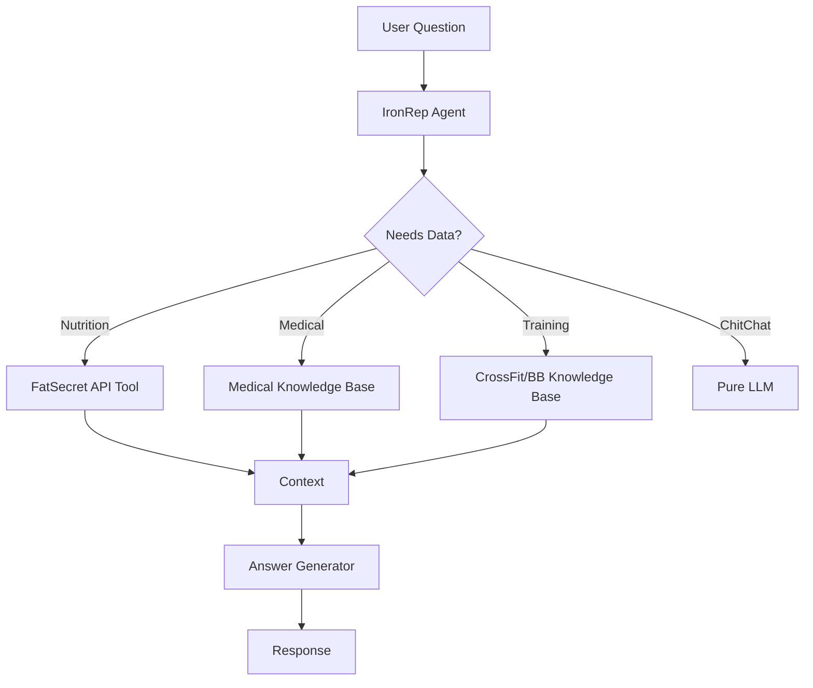

# 🧠 Implementation Plan - IronRep "Agentic RAG"

## Goal
Transform IronRep from a simple "Chatbot" to an **Agentic AI** that uses **Tools** (FatSecret API, Local RAG) to verify data and avoid hallucinations.

## 🔴 Current Problems
1. **Hallucinations**: AI invents nutrition values.
2. **Generic Answers**: Does not distinguish between Bodybuilding (hypertrophy) vs CrossFit (conditioning).
3. **Bad Training Data**: Recipes mixed with exercises.

## ✅ Proposed Solution: "RAG-ception"

The AI will **Think** before answering:
1. **User**: "How many calories in a Margherita pizza?"
2. **AI Thought**: "I need nutritional data. Using `FatSecretTool`."
3. **Tool**: Search "Pizza Margherita" -> Returns JSON (Verified Data).
4. **AI Response**: "A Margherita pizza has 271 kcal/100g (Source: FatSecret)..."

### Architecture



## 🛠️ Implementation Steps

### Phase 1: Infrastructure & Tools
- [ ] Add `FATSECRET_KEY` and `FATSECRET_SECRET` to Settings.
- [ ] Create `FatSecretTool` (Search + Get Nutrition).
- [ ] Create `TrainingRAGTool` (Retrieve from Markdown files).
- [ ] Create `MedicalRAGTool` (Retrieve from Protocol JSONs).

### Phase 2: Agent Refactoring
- [ ] Refactor [LLMService](file:///home/autcir_gmail_com/develop/apps/ironRep/apps/backend/src/infrastructure/ai/llm_service.py#36-351) to support Tool selection.
- [ ] Implement ReAct loop (Reason + Act).

### Phase 3: Dataset Regeneration (The "Agentic" Dataset)
- [ ] Write `generate_agentic_dataset.py`.
- [ ] Create samples with **Thought/Action/Observation** structure.
- [ ] Example:
  ```json
  {
    "messages": [
      {"role": "user", "content": "How many calories in an apple?"},
      {"role": "assistant", "content": "I should check the nutritional database.\n<tool_code>fatsecret.search('apple')</tool_code>"}
    ]
  }
  ```

### Phase 4: Training & Deploy via Ollama
- [ ] Use Ollama (llama3.2) as the brain.
- [ ] No fine-tuning needed immediately if Prompt Engineering + Tools works well.
